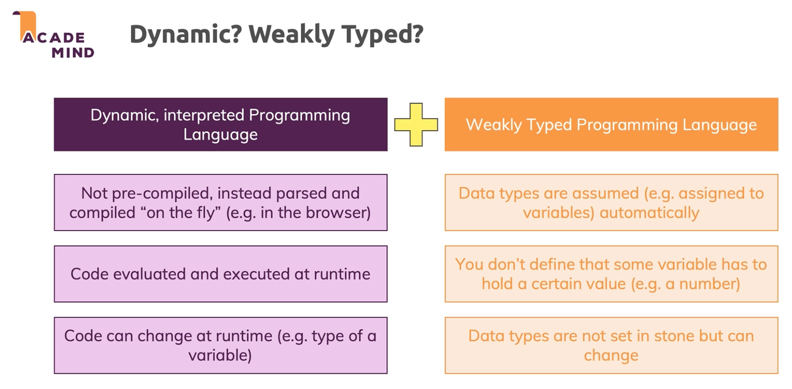

# Dynamic vs Weakly Typed Languages

When discussing programming languages, a key topic is how they manage **data types**. Two important terms often come up: **dynamic typing** and **weak typing**. These describe **when** and **how** a language determines and enforces the types of values in your code.

---

## 🧠 What is Dynamic Typing?

**Dynamic typing** means that a variable’s type is **determined at runtime**, not at compile-time. You don’t declare the type; instead, the interpreter figures it out based on the value assigned.

### ✅ Characteristics:
- **No need for explicit type declarations**
- **Variable types can change during execution**
- **Common in interpreted languages** (e.g., Python, JavaScript, Ruby)

### 🧪 Example – Python (Dynamically Typed):
```python
x = 5       # x is an integer
print(type(x))  # <class 'int'>

x = "hello" # Now x is a string
print(type(x))  # <class 'str'>
```

This flexibility makes prototyping faster, but can also lead to runtime errors if types are not handled carefully.

---

## 🧪 What is Weak Typing?

A **weakly typed language** allows **implicit type conversion** (type coercion). This means you can combine values of different types without manually converting them, and the language will try to make it work — often silently.

### ✅ Characteristics:
- **Automatic type coercion**
- **Looser type enforcement**
- **Can lead to unexpected results**

### 🧪 Example – JavaScript (Weakly Typed):
```javascript
console.log(5 + "5");   // "55" – number + string = string
console.log("5" * 2);   // 10  – string coerced to number
console.log(null + 1);  // 1   – null coerced to 0
```

This can be convenient, but also dangerous if you're not aware of what’s happening behind the scenes.

---

## 🔍 Dynamic vs Weak Typing: Key Differences

| Feature            | Dynamic Typing                          | Weak Typing                                |
|--------------------|-----------------------------------------|---------------------------------------------|
| **When type is known** | At runtime                            | May be known, but converted implicitly       |
| **Type declaration** | Not required                          | Not necessarily required                     |
| **Type safety**     | Type errors occur at runtime           | Type errors may be silently avoided via coercion |
| **Flexibility**     | High                                   | High, but potentially error-prone            |

### 🧪 Comparison Example:
```javascript
// JavaScript: Dynamic + Weak
let a = 10;        // number
a = "ten";         // now a string

console.log(1 + "2"); // "12" (number + string -> string)
```

```python
# Python: Dynamic + Strong
x = 10
x = "ten"

print(1 + "2")  # ❌ TypeError: unsupported operand type(s)
```

---

## 💡 Language Examples

| Language     | Dynamic Typing | Weak Typing |
|--------------|----------------|-------------|
| Python       | ✅              | ❌ (Strong)  |
| JavaScript   | ✅              | ✅           |
| Ruby         | ✅              | ❌ (Strong)  |
| PHP          | ✅              | ✅           |
| Java         | ❌ (Static)     | ❌ (Strong)  |

---

## 🧾 Summary

- **Dynamic typing**: Type is determined **at runtime**, not declared in advance.
- **Weak typing**: Allows **implicit type conversion**, which can result in unpredictable outcomes.
- A language can be:
  - **Dynamically typed only** (e.g., Python)
  - **Weakly typed only**
  - **Both** (e.g., JavaScript)
  - **Neither** (e.g., Java is statically and strongly typed)

Knowing how your language handles types helps you write safer, more predictable code.

---


