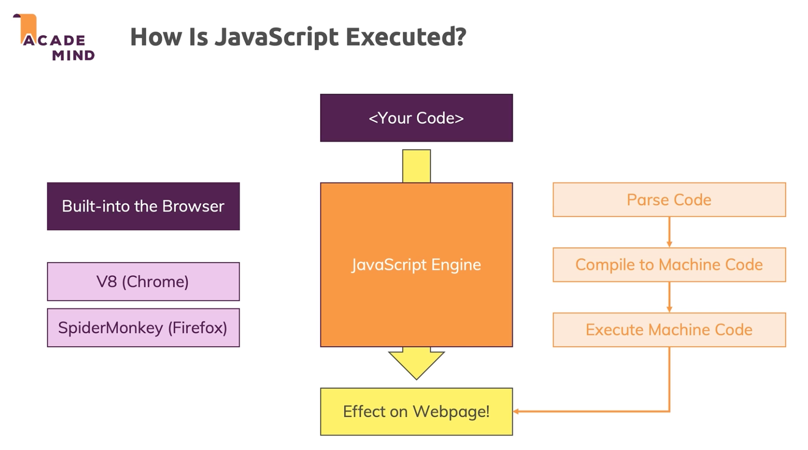
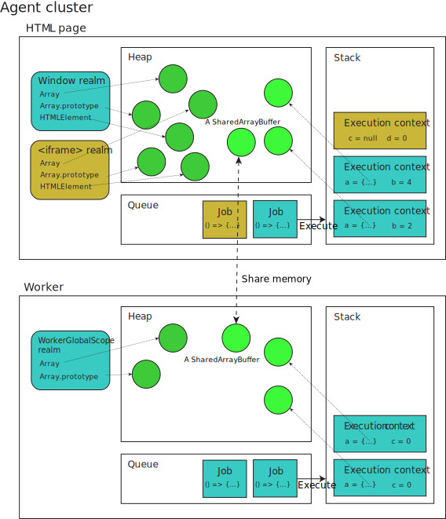
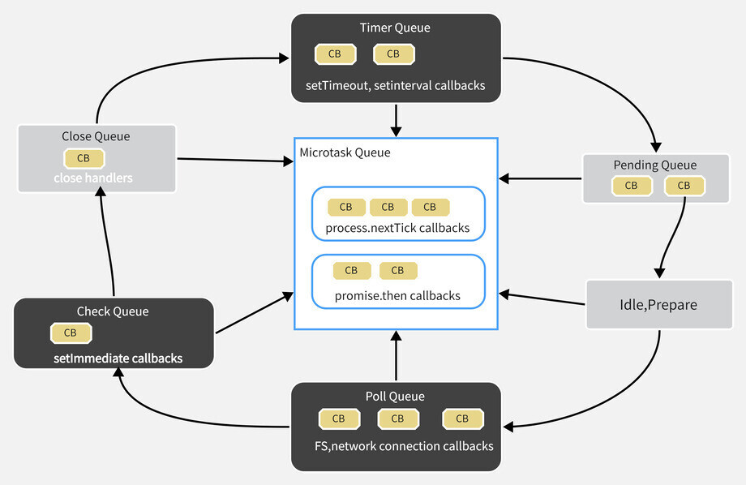
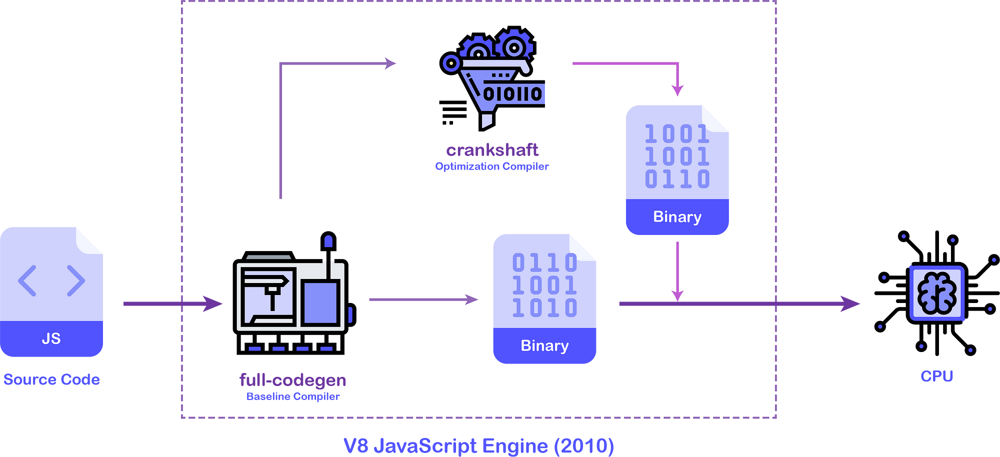
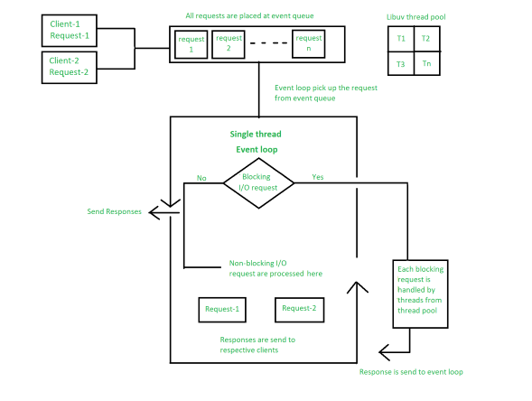
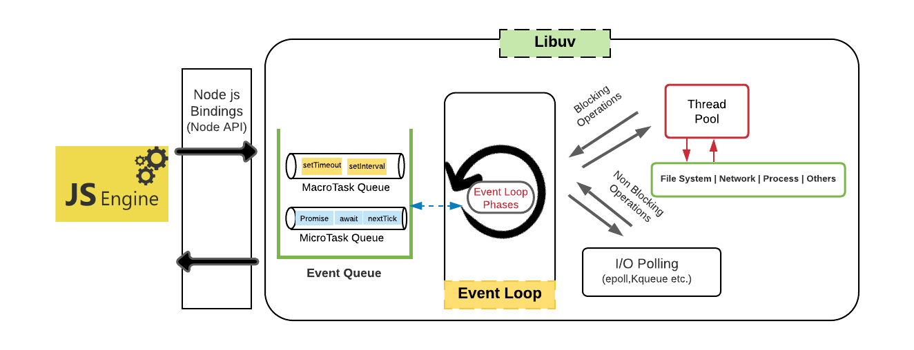
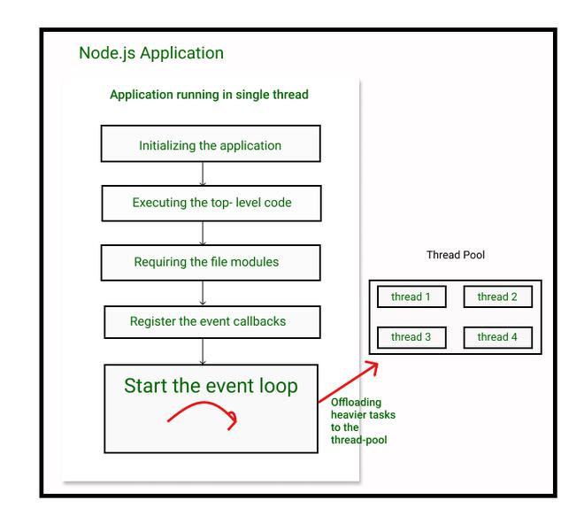
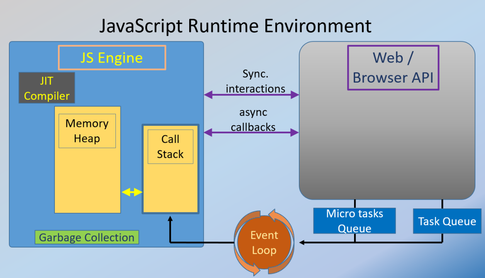
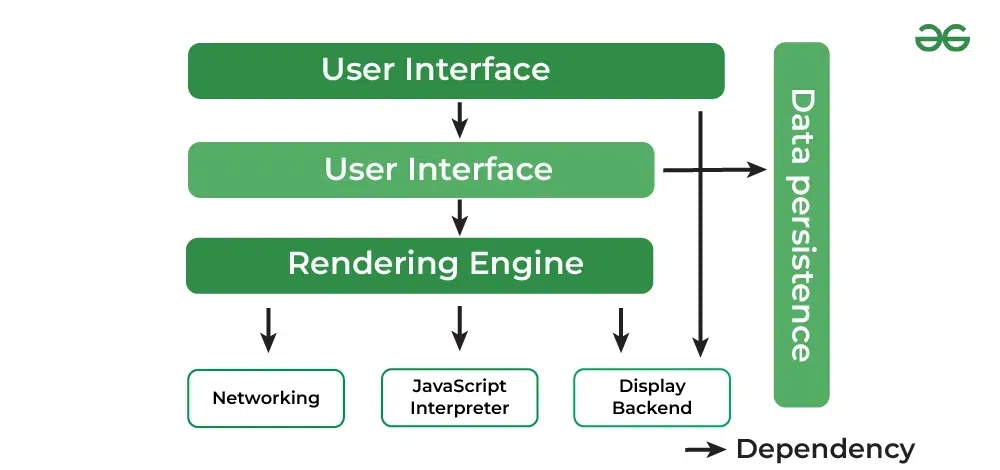

# JavaScript Execution Flow

JavaScript code does not simply "run" in one go. It goes through a series of phases—**parsing**, **compilation**, **execution**, and **asynchronous handling**—to turn code into functioning behavior in both browser and server environments.

## 1. Parsing

### Lexical Analysis
- JavaScript code is broken down into **tokens**—the smallest meaningful elements like keywords, operators, literals, etc.

### Syntax Parsing
- Tokens are structured into an **Abstract Syntax Tree (AST)**, which visually and structurally represents the code's logical flow.

## 2. Compilation

### Ignition Interpreter
- Converts the AST into **bytecode**, which is a lower-level, platform-independent representation that can be quickly executed.

### TurboFan Optimizer
- Identifies frequently used code paths (hot paths) and compiles them into **optimized machine code** for high performance.

## 3. Execution

### Call Stack
- Manages **function execution context**. Each function call creates a new frame; once complete, the frame is popped off the stack.

### Heap
- A memory area used to **store objects and data** during code execution.

### Garbage Collection
- Automatically reclaims memory that is no longer in use, preventing memory leaks and optimizing performance.

## 4. Event Loop (Asynchronous Operations)

### Web APIs (Browser) / libuv (Node.js)
- Handle asynchronous tasks like timers, I/O, and network requests outside the main thread.

### Callback Queue
- Stores **callbacks** (functions) waiting to be executed once the call stack is empty.

### Event Loop
- Continuously monitors the call stack and callback queue, pushing callbacks onto the stack when it's clear—enabling **non-blocking asynchronous execution**.

---

## Browser vs. Node.js Execution

### Browser Environment

- Executes JavaScript to **interact with the DOM**, respond to user events, and perform network operations.
- Utilizes **Web APIs** such as `fetch`, `setTimeout`, `document`, etc.
- Primarily responsible for **UI rendering** and event handling.

### Node.js Environment

- Runs JavaScript on the **server-side**, enabling backend operations like file access, network servers, and database communication.
- Uses **libuv** to handle asynchronous I/O efficiently.
- Provides **server-focused modules** such as `fs`, `http`, and `path`.

---

## Visual Diagrams

